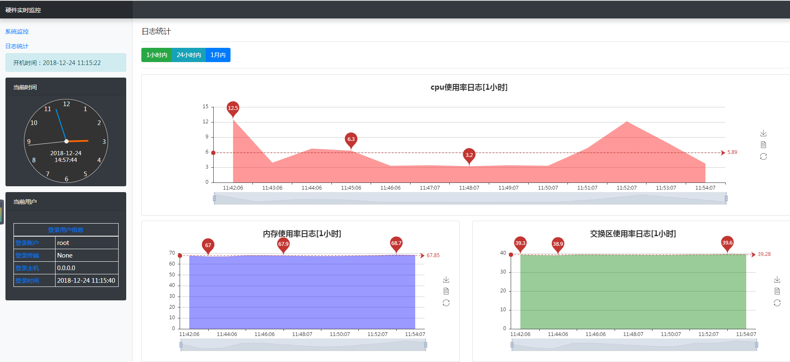

# monitor_demo
基于tornado和websocket的硬件监视系统

## 本地运行项目
1. 克隆项目到本地
```shell
git clone https://github.com/Sbwillbealier/monitor_demo.git
```
2. 创建并激活虚拟环境(可省略)
```
# 新建Python3版本的虚拟环境
conda create --name python3 python=3.5  
# 激活Python3环境
activate python3 
```
3. 安装依赖

进入项目目录
```
pip install -r requirements.txt
```
4. 迁移数据库
```
# 先在mysql数据库中创建monitor数据库
create database monitor charset=utf-8;

# 创建完数据库再执行下列创建表格命令
python app\models\models.py  # windows
python app/models/models.py  # linux
```

5. 修改monitor.js文件
```html
// 创建连接对象,并转化协议
conn = new SockJS('http://127.0.0.1:8000/real/time', transports); // 127.0.0.1:8000 换成实际运行主机ip和绑定端口
```

6. 运行程序
``` 
python manage.py --port=8000  # 指定端口
```
7. 运行日志采集脚本
```
python log.py  # 单独运行采集内存/交换分区/cpu使用率
```
8. 查看
```
127.0.0.1:8000
```

### 截图
  
  
  
  
